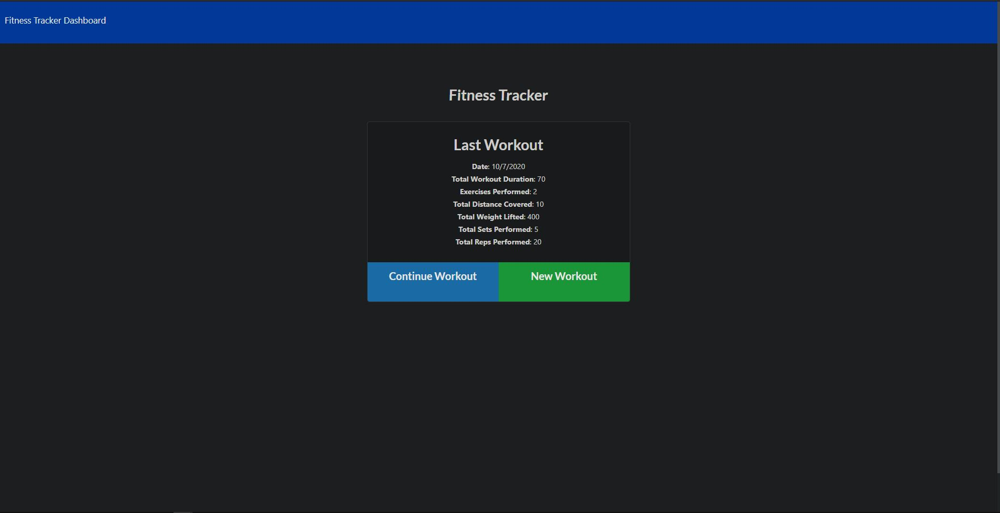
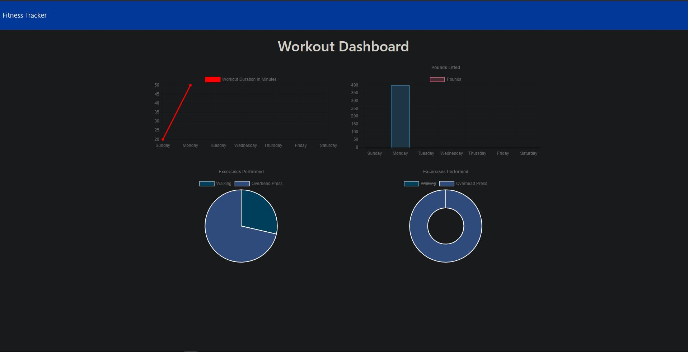

# Workout Tracker


The following application is meant for tracking and keeping up with your workouts. Users can create and customize their workout whether it be cardio or weight focused. In regards to strengt training, from a drop down menu users can adjust elements of the workout such as weight used, reps completed, etc. Conversely, if a user is going for a run, they are able to track the miles ran and the duration of that activity. This application utilizes technologies and NoSQL database elements such as; Node.js, MongoDB, HTML, CSS, JavaScript, and others. To view the deployed application, please click on the following link: 

## Features

A few of the things you can do with Workout Tracker:

* Input your unique workout regiment via a customizable menu.
* View a concise and straight forward breakdown of your workout via the workout dashboard.
* Easily create new workouts and view the overall exercise activity of your past week.

## User Story

```
AS a user
I want to be able to view create and track daily workouts. 
I want to be able to log multiple exercises in a workout on a given day. 
I want to be able to track the name, type, weight, sets, reps, and duration of exercise. 
If the exercise is a cardio exercise, I want to track my distance traveled.
SO THAT I can reach my unique exercise goals as easily and quickly as possible.
```

## Table of Contents


* [Installation](#installation)
* [License](#license)
* [Questions](#questions)
* [Contributors](#contributors)
* [Media](#media)

# Installation

To run this application locally, in the event the deployed page fails, please do the following;

Following downloading the repository, enter into your terminal:
- npm install

After you have done this, to run the application, please enter into your terminal: 
- node server.js

After this step, you can view the local application on your local host address at the port listed:
- http://localhost:8080/

# License

Application working under an MIT license

# Questions

Reach out to me via email regarding any questions or concerns with this project:
- chandler.lowrance1@gmail.com


# Contributors

| Chandler
------------ 

[<br /><sub><b>Chandler Lowrance</b></sub>](https://github.com/Chandler8)<br />[💻](https://github.com/Chandler8?tab=repositories "Repositories")

# Media



